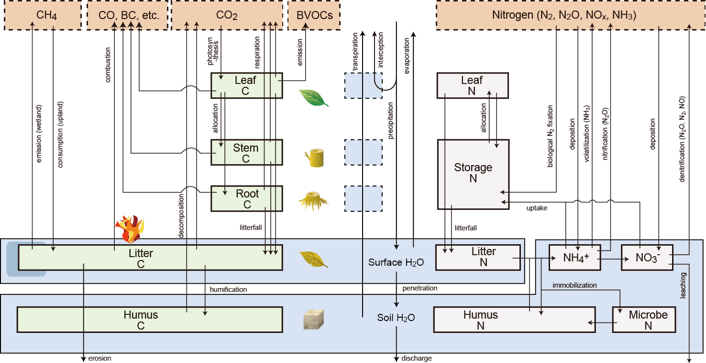

# VISITb

Developer: Akihiko Ito ( The University of Tokyo)

## Description

Tags: Biogeochemical, land-surface-models, site, continent-n-global, 1D

VISIT (Vegetation Integrative SImulator for Trace gases) is a process-based terrestrial ecosystem model simulating carbon, nitrogen, and water cycles. The model comprises both plant and soil components in an ecosystem in an integrated manner, allowing us to simulate land-atmosphere biogeochemical interactions. The model evaluates soil emissions of major greenhouse gases (CO2, CH4 [wetland emission and upland absorption], and N2O) at point to global scales, taking account of climate and land-use conditions. In broad-scale simulations, each grid mesh is sub-divided into natural upland, natural wetland, and cropland, and calculated separately. The soil carbon dynamics is simulated by box-flow schemes, which differ in complexity from a 2-box scheme at global scale to 9-box scheme at point scale. The soil nitrogen dynamics is also simulated by a box-flow scheme, which is composed of organic and inorganic nitrogen pools. The soil water budget is simulated with a simple 2-layer hydrological scheme, considering water-holding capacity determined by soil texture. The model is one of the earliest models that account for the impact of soil erosion on carbon budget (Ito, 2007). The model has been used for various kinds of studies related to climate change, spanning from diagnosis of current greenhouse gas budget, scenario development, climate projection including carbon-cycle feedback, climatic impact assessment, and assessment of mitigation and management options. The model has been validated with field data such as chamber and tower-flux measurements; at broad-scales, outputs of the model have been examined by using atmospheric data. The model is written in plain C language and performable on any platforms with C compiler.

## Overall Architecture

## Scientific Articles

- Inatomi, M., Ito, A., Ishijima, K., and Murayama, S.: Greenhouse gas budget of a cool temperate deciduous broadleaved forest in Japan estimated using a process-based model, Ecosystems, 13, 472-483, doi:10.1007/s10021-010-9332-7, 2010.
- Ito, A.: Simulated impacts of climate and land-cover change on soil erosion and implication for the carbon cycle, 1901 to 2100, Geophys. Res. Lett., 34, doi:10.1029/2007GL029342, 2007.
- Ito, A., and Inatomi, M.: Use of a process-based model for assessing the methane budgets of global terrestrial ecosystems and evaluation of uncertainty, Biogeosciences, 9, 759-773, doi:10.5194/bg-9-759-2012, 2012.
- Ito, A., and Oikawa, T.: A simulation model of the carbon cycle in land ecosystems (Sim-CYCLE): A description based on dry-matter production theory and plot-scale validation, Ecological Modelling, 151, 147-179, 2002.
- Ito, A., Nishina, K., and Noda, H. M.: Evaluation of global warming impacts on the carbon budget of terrestrial ecosystems in monsoon Asia: a multi-model analysis, Ecological Research, 31, 459-474, doi:10.1007/s11284-016-1354-y, 2016.
- Ito, A., Nishina, K., Ishijima, K., Hashimoto, S., and Inatomi, M.: Emissions of nitrous oxide (N2O) from soil surfaces and their historical changes in East Asia: a model-based assessment, Progress in Earth and Planetary Science, 5, doi:10.1186/s40645-40018-40215-40644, 2018.

## Technical Information

- Operating system(s): MacOS, UNIX, Windows (C compiler required)
- Licence: freely available
- Output(s): plant carbon stock, productivity, soil carbon stock, soil respiration, ecosystem productivity, water budget, greenhouse gases (CO2, CH4, and N2O) budget, biomass burning emission, BVOC emission, soil erosion, DOC discharge
- Export format(s): binary or text output files

## Questions

For questions, please contact akihikoito@g.ecc.u-tokyo.ac.jp or use GitHub Issues or the organization Discussions feature.
